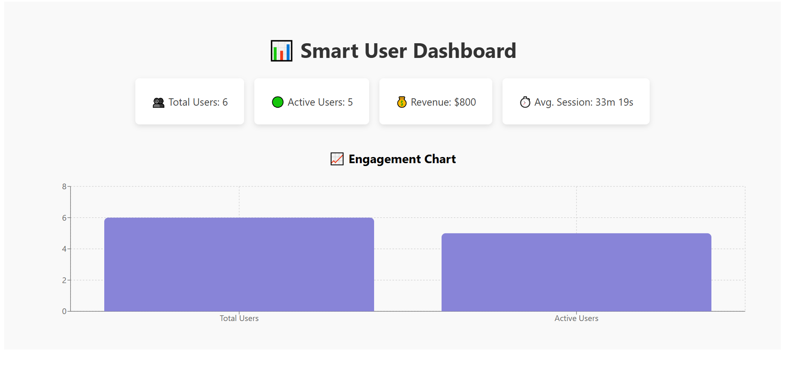

# Smart Data Dashboard 👨‍💻📊

This is a simple full-stack dashboard I built to show useful user stats from a CSV file.  
It reads data using **PySpark**, processes it with a **FastAPI** backend, and shows everything in a clean **React.js** frontend.

---

## What's Inside

- ✅ Total users
- ✅ Active users (in the last 3 days)
- ✅ Total revenue
- ✅ Average session time (in minutes & seconds)
- ✅ Bar chart to make things visual

---

## Tech I Used 🧰

- **Frontend:** React.js, Vite, Recharts
- **Backend:** FastAPI
- **Data:** PySpark (reads and processes the CSV)
- **API:** REST API with CORS support

---

## How to Run This Project Locally 🏃‍♂️

### 1. Clone the Repo

```bash
git clone https://github.com/pradeep0232/smart-data-dashboard.git
cd smart-data-dashboard
```

### 2. Start the Backend

```bash
cd backend
python -m venv venv
venv\Scripts\activate   # For Windows
pip install -r requirements.txt
uvicorn main:app --reload
```

Make sure your CSV file is in:
```
backend/data/user_data.csv
```

### 3. Start the Frontend

```bash
cd ../frontend
npm install
npm run dev
```

Then go to: [http://localhost:5173](http://localhost:5173)

---

## Screenshot 🖼️



---

## What This Project Shows

> That I understand how to connect a React frontend with a FastAPI backend and process data using PySpark.  
> I know how to work with APIs, display data visually, and keep things clean and responsive.

---

## Resume Description 📝

**Smart Data Dashboard** — Built a full-stack dashboard using React, FastAPI, and PySpark to analyze and display user metrics from CSV data. Integrated REST APIs, data filtering, and chart visualization with a clean and responsive UI.

---

## Contact

Made with ❤️ by [Pradeep Kumar](https://github.com/pradeep0232)
